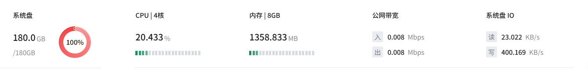
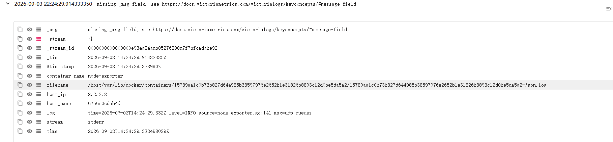

## 主机资产详情
主机名、IP、所属地，CPU核数、内存总量、系统盘总大小，操作系统，总告警数。

告警数量（各类告警数量分段水平图，包括高中低三个优先级）
CPU、内存、网络IO趋势图。 

告警列表。
最占用资源的服务排行。

补充：
基本信息：纳管状态、所属项目、外部IP。顶部的返回和名字等信息放到基本信息卡片中。

在基本信息中加一个监控概要的卡片，样式参考下面，并且将原来的告警数量卡片去掉，其信息放到概要中，以环形图展示，环形图中间是总数

去掉右上角的刷新数据和编辑资产，在资源趋势增加一个筛选时间范围，默认是近1h，频率是5m，
资源占用服务排行信息放到概要中

顶部添加tabs，告警列表放到另一个tabs中。

新增一个日志卡片，日志有趋势图，趋势图下面有日志列表（分页）。
日志类型有如下几个大类：
- 文件日志
- systemd日志
- docker日志
- k8s pod日志

用户可以基于日志类型，自定义添加日志源。
如果不选择日志类型，则列表只展示发生事件、日志内容、日志类型三个字段。
但选择日志类型后，会展示该类型额外的基本字段。

### 补充-2
1. 日志列表加上日志源字段
2. 日志相关信息也放到一个tabs中，
3. 日志可以被点开，会展示它的所有字段，类似于下面的效果

4. 概要放到tabs的上方，所有tabs都能看到